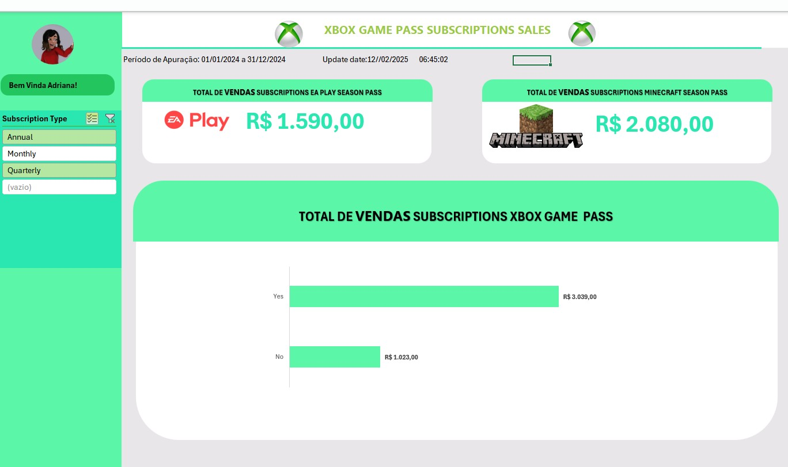

# Dashboard de Vendas Xbox 🎮

Projeto desenvolvido como parte do desafio da **DIO (Digital Innovation One)**. O objetivo foi criar um painel interativo para análise de vendas de consoles e jogos.

## 📊 Visualização do Projeto

## 🛠️ Tecnologias Utilizadas
* **Excel:** Tabelas Dinâmicas, Segmentação de Dados, Gráficos Personalizados.
* **Design:** Identidade visual baseada na marca Xbox.

## 🚀 Como testar o Dashboard
1.  Baixe o arquivo https://github.com/IDarkMoon7/dashboard-vendas-xbox-excel/blob/main/Desafio_Xbox.xlsx clicando nele acima e depois em "Download".
2.  Abra no Excel e utilize os botões de segmentação para filtrar os dados.
3.  Habilite a edição (se solicitado) para interagir com os filtros.

---
Desenvolvido por Keite Mascena.
